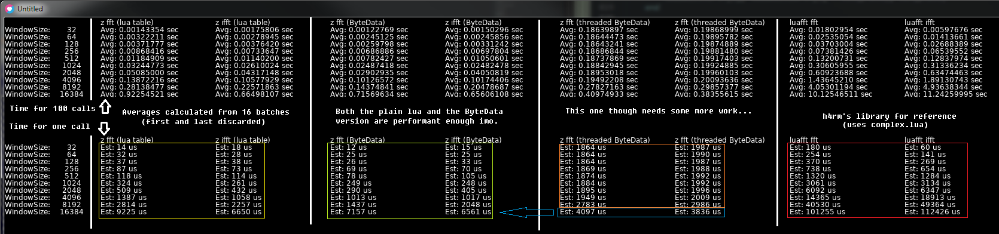

zfft
----------------------------------------------------------

### Info

zfft is a fast (enough) LÖVE/luaJIT-powered rewrite of luafft by @h4rm, which in turn is an implementation of kissfft by @mborgerding.

There are two versions of this library:
- A single file version in src/lua, which works with lua version 5.1 (and may work with others, although at least luaJIT is still recommended for performance reasons)
- One in src/love that requires the LÖVE game framework; currently supported LÖVE versions: 11.x

### Usage

`local zfft = require 'zfft'`

src/lua:

```lua

	local sampleRate = 44100
	local frequency = 440
	local size = 2048
	local inRe = {}
	for i=1, size do
		inRe[i] = math.sin(math.pi * 2 * frequency / sampleRate)
		-- window using triangular window function
		inRe[i] = inRe[i] * math.min(1.0, ((i-1)*2)/size) * math.min(1.0, ((size-(i-1))*2)/size)
	end
	local outRe, outIm = zfft.fft(inRe)
	-- From here, sky's the limit...

```

src/love:
*An audio visualization library utilizing this library will be linked here, when it's done...*

### API (src/lua)

#### fastsize = nextFastSize(size)
Returns the next-largest input size that can make use of the defined optimized butterfly functions (for radixes 2,3,4 and 5), in which case the inputs need to be zero-padded to this returned size.

#### outputRe, outputIm = fft(inputRe, inputIm)
Calculates the fft on the given input arrays, the real and imaginary parts passed in separately.
The imaginary input array may be omitted.

#### outputRe, outputIm = ifft(inputRe, inputIm)
Calculates the inverse fft on the given input arrays, the real and imaginary parts passed in separately.
The imaginary input array may be omitted (but usually isn't.)

### API (src/love)

#### fastsize = nextFastSize(size)
Returns the next-largest input size that can make use of the defined optimized butterfly functions (for radixes 2,3,4 and 5), in which case the inputs need to be zero-padded to this returned size.

#### setMaxTwiddleSize(maxsize)
Due to memory considerations, the twiddle arrays are defined outside of any function calls, and are effectively re-used; hence, the maximum size needs to be settable; this needs to be not less than the i/fft's input array(s') size(s).

#### setupThreads(threadCount)
Spawns *threadCount* worker threads that the threaded i/fft methods can utilize.

#### freeThreads()
Gracefully ends all running worker threads. This should be called in the love.quit callback at the very least, if setupThreads has been called.

#### [outputRe, outputIm] = fft(inputRe, inputIm[, outputRe, outputIm])
Calculates the fft on the given input arrays, the real and imaginary parts passed in separately.
The imaginary input array may be omitted.

#### [outputRe, outputIm] = ifft(inputRe, inputIm[, outputRe, outputIm])
Calculates the inverse fft on the given input arrays, the real and imaginary parts passed in separately.
The imaginary input array may be omitted (but usually isn't.)

#### [outputRe, outputIm] = fft_t(inputRe, inputIm[, outputRe, outputIm])
Calculates the fft on the given input arrays, the real and imaginary parts passed in separately.
The imaginary input array may be omitted.
Utilizes worker threads for top-level work function call.

#### [outputRe, outputIm] = ifft_t(inputRe, inputIm[, outputRe, outputIm])
Calculates the inverse fft on the given input arrays, the real and imaginary parts passed in separately.
The imaginary input array may be omitted (but usually isn't.)
Utilizes worker threads for top-level work function call.

#### i/fft/_t synopsys
All four of the above support multiple input types:
- One input lua table (real only)
- Two input lua tables (real and imaginary)
- One input luaJIT FFI double array (real only)
- Two input luaJIT FFI double arrays (real and imaginary)
- One input LÖVE SoundData (one channel only) (real only)
- Two input LÖVE SoundDatas (both one channel only) (real and imaginary)
In the above 6 cases, the input(s) will be converted to LÖVE ByteData objects.
- One input LÖVE ByteData (sized to input size * size(double)) (real only)
- Two input LÖVE ByteData (both sized to input size * size(double)) (real and imaginary)
In the above 8 cases, the functions will return two LÖVE ByteData objects with the results.

In case of passing in 4 LÖVE ByteData objects (each sized to input size * size(double)), the second pair will be used to put the results into, in which case one may omit using the function's return values.

### Benchmark

The below values are just averages, performance can vary.
The main take-away should be that the threaded variant isn't much faster in any case when the window size is not 16k, so it might as well not be used.



### Version History

#### V1.0

	First release.

#### TODO:
- Fix butterfly functions of radix 5 and the generic one, current implementations show ringing with pure tones. (This isn't an issue if one sticks to power of two input sizes.)

### License
This library licensed under the ISC License.